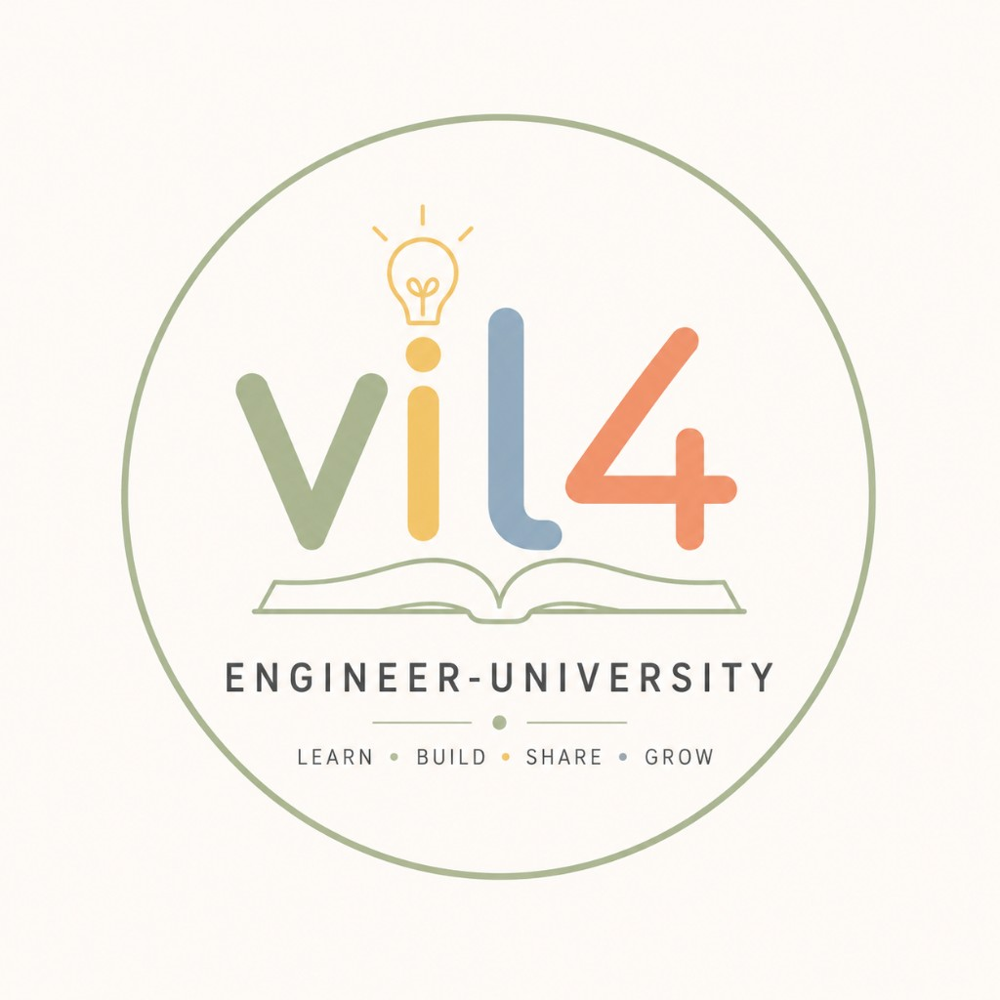

# Engineering University

  

Long-term engineering education system (10+ years) for two students: an experienced engineer structuring Senior-level craft, and the next generation learning from first principles.

Not a note dump. A **living university**: ideas over tech catalogs, practice + Evidence, one Source of Truth.

**Org:** [vil4engineering](https://github.com/vil4engineering) · **Repo:** [univer](https://github.com/vil4engineering/univer) · **Site:** [vil4engineering.github.io/univer](https://vil4engineering.github.io/univer/)

---

## Start learning (now)

Study is **unlocked**. Mode A (Interview Bootcamp) is active.

| Who | First steps |
|-----|-------------|
| **Student A** (Senior iOS prep) | [campus/ASSISTANT_MANUAL.md](campus/ASSISTANT_MANUAL.md) → [Path Alpha](campus/paths/alpha.md) → spine [ROADMAP_SENIOR.md](campus/ROADMAP_SENIOR.md) · deep track **M03 Concurrency** (`swift/concurrency/`) |
| **Student B** (foundations) | [Path Beta](campus/paths/beta.md) → entry chapter [What is programming?](fundamentals/what-is-programming/) ([DESIGN](fundamentals/what-is-programming/DESIGN.md) ready; body pending) |
| **Daily rhythm** | [OPERATING_MODES.md](campus/OPERATING_MODES.md) — pulse → dive → questions → write-back → mock → Evidence |

**Fill model:** do not finish the whole catalog. Prep a topic → questions → notes on the canonical page (+ playground / `projects/` link when it exists).

---

## Start writing a chapter

One bookmark for authors and AI:

1. [`.ai/workflows/chapter-fill.md`](.ai/workflows/chapter-fill.md)  
2. Copy [design-chapter](.ai/prompts/design-chapter.md) — change **only** `# Тема`  
3. Approve DESIGN → [write-chapter](.ai/prompts/write-chapter.md)

Philosophy / language / shape live under [`.ai/principles/`](.ai/principles/) (content-philosophy · chapter-shape · language).

---

## Core ideas

- Why before how; stories over reference manuals  
- Russian explains; English names the craft ([LANGUAGE](campus/LANGUAGE.md))  
- Evidence over vibes ([PROGRESS](campus/PROGRESS.md))  
- SE at the center; Mobile Systems = depth; AI = tool + technology  
- Interviews are a side effect of competence  

Charter: [01_CHARTER.md](01_CHARTER.md)

---

## Map

| Need | Go |
|------|-----|
| Campus OS (students) | [campus/](campus/) |
| Status / freeze gates | [PROJECT_STATUS.md](PROJECT_STATUS.md) |
| Library catalog | [campus/library/](campus/library/) |
| Labs / staged projects | [campus/projects-map.md](campus/projects-map.md) · [projects/](projects/) |
| AI agents | [AGENTS.md](AGENTS.md) · [`.ai/README.md`](.ai/README.md) |
| Living University capture | [DESIGN_CAPTURE…](campus/DESIGN_CAPTURE_LIVING_UNIVERSITY.md) |

Governance specs: [01](01_CHARTER.md) · [02](02_PHILOSOPHY.md) · [03](03_CURRICULUM.md) · [04](04_STRUCTURE.md) · [05](05_PATHS.md)
