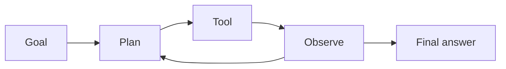

# AI Agent

Russian: ИИ-агент

Category: Agents

Importance: Essential

Status: full

## Definition

AI Agent — система, где LLM не просто отвечает текстом, а **планирует шаги и вызывает tools** в цикле, пока не достигнет цели или лимита.

## Why it matters

Агенты дают автоматизацию (браузер, CRM, CI), но повышают cost, latency и риск ошибок — нужны guardrails и evals.

## Example

Агент: «найди failing test → прочитай лог → предложи патч» через tools `run_tests`, `read_file`, `apply_diff`.

## Related

- [Tool Calling](tool-calling.md)
- [Planner](planner.md)
- [MCP](mcp.md)
- [Topic: Agents](../../agents/)
- [Glossary portal](../../../glossary/)
