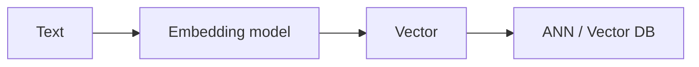

# Embedding

Russian: эмбеддинг

Category: Embeddings

Importance: Essential

Status: full

## Definition

Embedding — вектор (список чисел), который кодирует смысл текста/картинки так, что похожие по смыслу объекты близки в пространстве.

## Why it matters

Основа semantic search и RAG: документы и запрос сравниваются через similarity, а не только keyword match.



## Example

```python
q = embed("как вернуть товар")
docs = vector_db.search(q, top_k=5)
```

На Apple: `NLEmbedding` для части NLP-задач; для LLM-RAG чаще cloud/open embedding API.

## Related

- [Vector](vector.md)
- [Semantic Search](semantic-search.md)
- [RAG](rag.md)
- [Topic: Embeddings](../../embeddings/)
- [Glossary portal](../../../glossary/)
