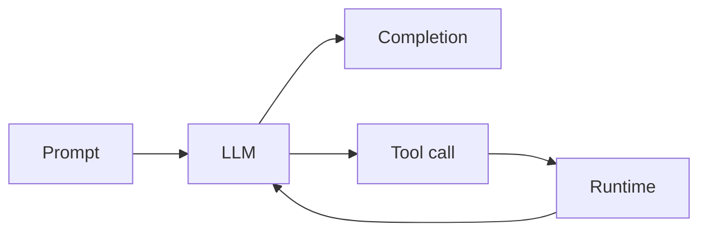

# LLM

Russian: большая языковая модель (Large Language Model)

Category: LLM

Importance: Essential

Status: full

## Definition

LLM — модель, обученная предсказывать следующий **token** на огромных текстах. Через prompting и tools её используют как универсальный текстовый движок.

## Why it matters

Центр современного AI engineering: chat, RAG, agents, codegen. Инженер обязан понимать tokens, context window, cost и failure modes (hallucination).

## Example

Пользователь спрашивает «суммируй этот PDF» → app кладёт чанки в context → LLM пишет summary.

## Related

- [Token](token.md)
- [Prompt](prompt.md)
- [Context Window](context-window.md)
- [Topic: LLM Basics](../../llm-basics/)
- [Glossary portal](../../../glossary/)
