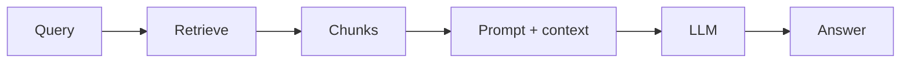

# RAG

Russian: retrieval-augmented generation

Category: Retrieval (RAG)

Importance: Essential

Status: full

## Definition

RAG — паттерн: **retrieve** релевантные фрагменты из knowledge base, **augment** ими prompt, затем **generate** ответ моделью. Снижает галлюцинации на частных данных.

## Why it matters

Главный способ дать LLM доступ к свежей/приватной базе знаний без полного fine-tune.

## Example

Корпоративный wiki → chunking → embeddings → user question → top-k chunks в context → ответ со ссылками.

## Related

- [Retrieval](retrieval.md)
- [Chunking](chunking.md)
- [Grounding](grounding.md)
- [Hallucination](hallucination.md)
- [Topic: RAG](../../rag/)
- [Glossary portal](../../../glossary/)
