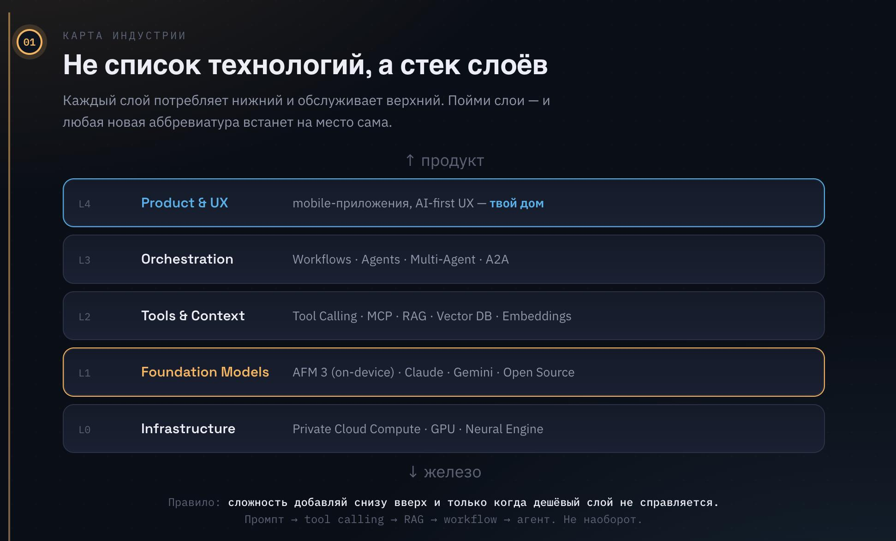
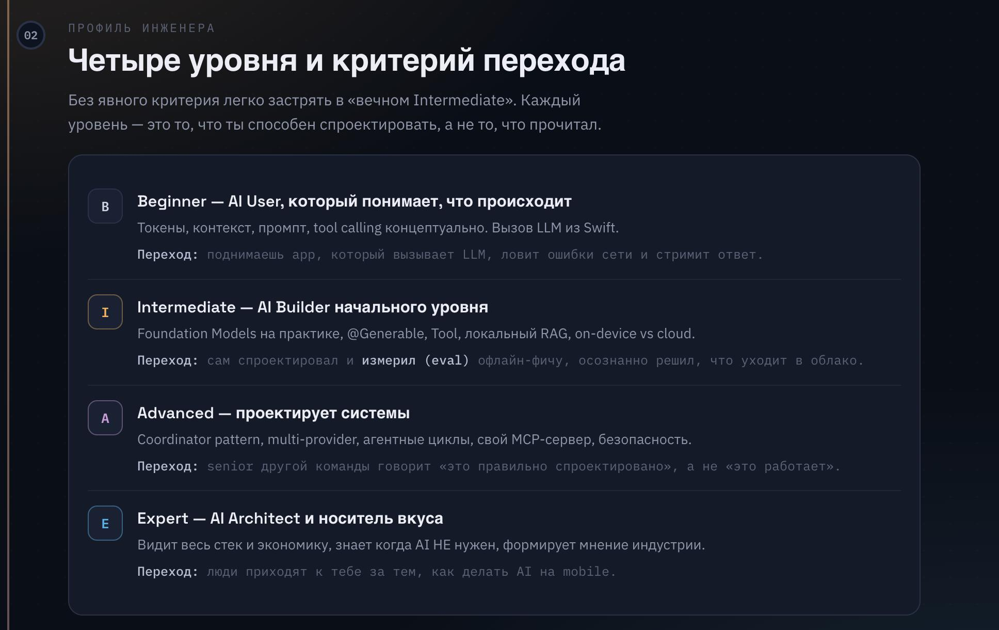
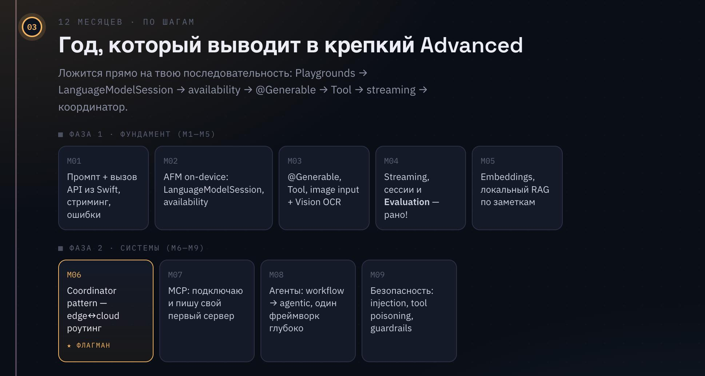
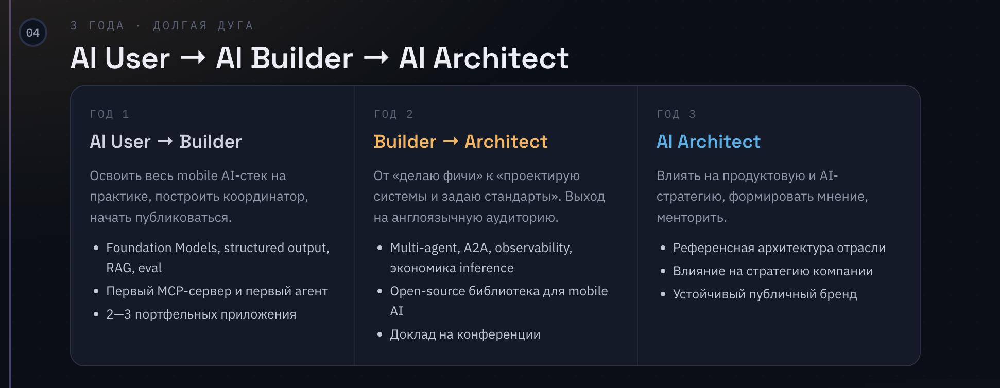
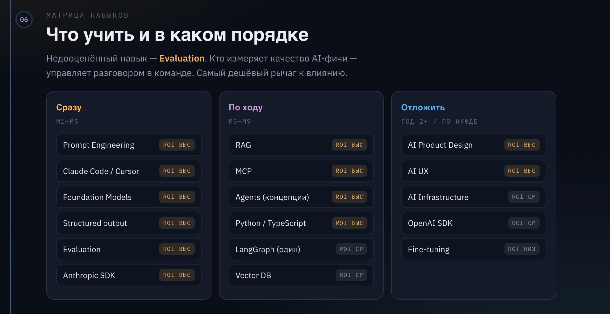

# AI Native Engineer Roadmap (accompanying slides)

| Field | Value |
|-------|-------|
| Kind | accompanying material (not a chapter) |
| Source | Telegram Saved `502938`–`502943` (album) |
| Captured from TG | 2026-06-24 |
| Added to repo | 2026-07-24 |
| Useful? | pending |
| Related | [ai-engineering/roadmap/](../../roadmap/) · Track 1 [ai-assisted](../../../campus/faculties/ai-assisted.md) |

Короткий текст из поста: AI Native engineer — не vibe-coder, а оркестратор и AIOps; роадмап / модель зрелости для изучения AI-тулкитов.

Слайды ниже почти зеркалят существующий [Roadmap](../../roadmap/) в репо. Держим как исходник/компаньон, пока не решим: слить, улучшить roadmap, или выкинуть.

## Slides

### 01 · Карта индустрии (стек слоёв)

### 02 · Профиль инженера (4 уровня)

### 03 · 12 месяцев по шагам

### 04 · Три года · долгая дуга

### 05 · Что не учить

### 06 · Матрица навыков

## Review later

- [ ] Useful for students / Path Alpha?
- [ ] Diff vs [roadmap/README.md](../../roadmap/README.md) — anything missing there?
- [ ] Keep / merge / delete

When reviewed, set `Useful?` in [../README.md](../README.md) and here.
