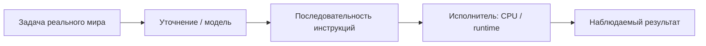
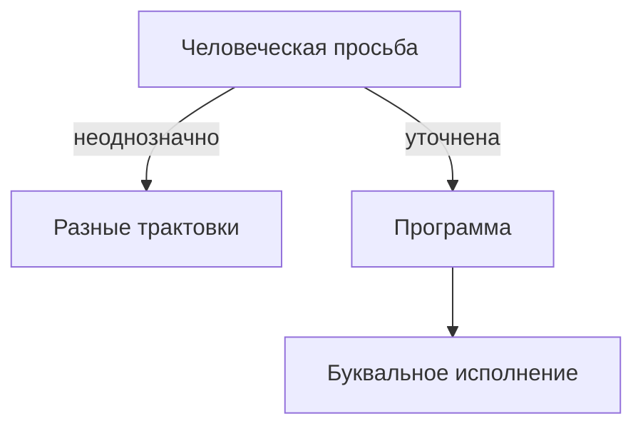
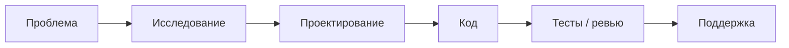
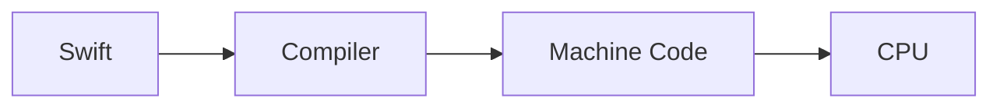
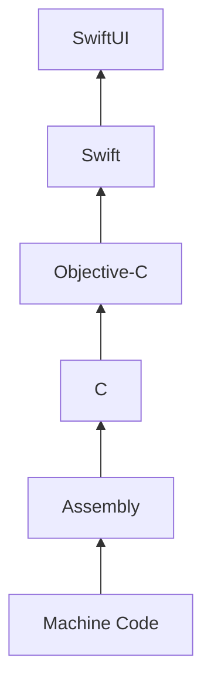
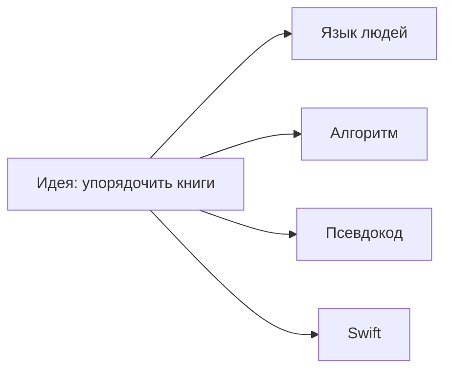

# DESIGN — Что такое программирование?

**Статус:** дизайн страницы · **глава ещё не написана**  
**Topic id (proposed):** `fundamentals/what-is-programming`  
**Faculty:** Computer Science (+ вход в Software Engineering)  
**Paths:** Beta Step 1–3 · Alpha Stage 0/1 pulse (перечитать глазами Senior)  
**Interview Heat:** ★★★ (ментальная модель; не API trivia)  
**Levels target:** 1 обязателен · 2 обязателен · 3 = тонкий «под капотом инструкций» (без компилятора вглубь)

**Fundamental question (why):**  
Почему «уметь писать код» недостаточно, чтобы назвать себя инженером - и что тогда *на самом деле* делает программирование с задачами реального мира?

**Главная мысль (north star главы):**  
Программирование - это процесс превращения задач реального мира в последовательность точных инструкций, которые способен выполнить компьютер.

**Анти-цель:** справочник «что такое переменная / цикл». Это глава про **идею**, не про синтаксис Swift.

**После ревью:** Author пишет главу по этому дизайну через [write-chapter](../../.ai/prompts/write-chapter.md) (см. [chapter-fill](../../.ai/workflows/chapter-fill.md)). Этот файл остаётся архитектурным контрактом страницы.

Связано: [content-philosophy](../../.ai/principles/content-philosophy.md) · [chapter-shape](../../.ai/principles/chapter-shape.md) · [language](../../.ai/principles/language.md) · [TOPIC_TEMPLATE](../../campus/TOPIC_TEMPLATE.md)

---

## Hero

| Элемент | Дизайн |
|---------|--------|
| **H1** | Что такое программирование? |
| **Подзаголовок** | Не умение набирать код. Умение превращать неясные задачи мира в инструкции, которые машина выполнит буквально. |
| **Pull quote / обложка** | *Компьютеры не умнее калькулятора. Они просто невероятно дисциплинированы.* |
| **Hero visual** | Темная/нейтральная сцена: человек у доски объясняет «как заварить чай» идеальному исполнителю (без лица-робота-клише). Рядом - тонкая лента: задача → инструкции → результат. |
| **Reader promise (1 строка)** | После этой главы ты перестанешь путать «написал файл .swift» и «решил инженерную проблему». |

**Callout (Hero):** «Эта глава - вход в Engineering University. Её можно читать в 14 лет и в 40 - на разной глубине.»

---

## Карта страницы (скелет)

```text
Hero
→ Интуиция (история-крючок)
→ Проблема
→ История (рассказ, не даты)
→ Главная идея
→ Что делает программист
→ Программирование vs инженерия (Senior-слой)
→ Языки: Swift → Compiler → Machine Code → CPU
→ Абстракции (лестница)
→ Практический пример (одна задача × 4 формы)
→ Production (полный цикл)
→ Интервью
→ Практика / упражнения
→ Связанные темы
→ Что читать дальше
→ Рефлексия
```

Длина целевая: **читается за 20–35 мин** на L1–L2; Senior пробегает L2 + «Программирование vs инженерия» + Interview за 10–12 мин.

---

## Интуиция

**Задача секции:** зацепить эмоционально и дать Level 1 якорь без определений.

**Открывающая история (утверждённый угол):**

> Представьте: завтра компьютеров нет. Остался очень исполнительный помощник - никогда не ошибается, ничего не «додумывает», выполняет только то, что сказано. Сможете ли вы объяснить ему, как заварить чай? Как отсортировать книги на полке? Как посчитать зарплату?  
> В момент, когда вы пытаетесь убрать двусмысленность из обычной речи - вы уже занимаетесь программированием.

**Почему это работает для аудиторий:**

| Читатель | Что цепляет |
|----------|-------------|
| Школьник | Игра «объясни идеальному дураку» |
| Junior | Узнаёт боль «компьютер сделал не то» |
| Senior | Сразу видит ambiguity / specs / edge cases |
| Interview prep | Мост к clarifying questions на system design |

**Визуал:** комикс из 3 кадров: (1) размытая просьба «сделай чай вкусным» (2) хаос трактовок (3) чеклист инструкций → чашка.

**Не делать:** начинать с «Programming is …» / вики-абзаца.

---

## Проблема

**Фундаментальная проблема:** мир полон задач, которые нужно повторять точно, быстро и без усталости человека - но естественный язык неоднозначен, а машина понимает только однозначные инструкции.

**Подвопросы страницы:**

1. Почему «просто сказать человеку» недостаточно для масштаба?  
2. Почему появились *программы*, а не только разовые ручные расчёты?  
3. Что ломается, если инструкции неполны?

**Callout «Почему это важно сегодня»:** AI/vibe-coding не отменяет проблему - модель всё равно исполняет (или генерирует) инструкции; неоднозначность остаётся на человеке-инженере.

**Диаграмма D1** - см. раздел Диаграммы.

---

## История

**Форма:** короткий рассказ «как менялся *способ говорить* с машиной», не таймлайн ради дат.

**Сюжетная дуга:**

```text
Jacquard Loom (узор как программа ткани)
  → перфокарты
  → Babbage (машина, которой нужна последовательность операций)
  → Ada Lovelace (алгоритм как идея, отдельная от железа)
  → ранние компьютеры + Machine Code
  → Assembly
  → C (абстракция ближе к человеку, всё ещё близко к машине)
  → Objective-C / экосистема Apple
  → Swift
```

**Главный тезис истории (повторить 1 раз явно):**  
Менялись **языки и носители** инструкций. Не исчезала сама идея: *задача → точная последовательность шагов → исполнитель*.

**Таблица (компактная):**

| Эпоха | Способ «сказа» | Что скрыто |
|-------|----------------|------------|
| Ткацкий станок / карты | дырки = команда | механика станка |
| Machine Code | числа-инструкции | электрика CPU |
| Assembly | мнемоники | кодирование опкодов |
| C | выражения ближе к математике | память, указатели частично явны |
| Swift | безопасные абстракции | Compiler + runtime |
| SwiftUI | декларативное описание UI | дерево/layout/runtime |

**Не делать:** биографии на полстраницы; «кто изобрёл» без связи с идеей главы.

---

## Главная идея

**Одно предложение (якорь):** компьютер ничего не «понимает» в человеческом смысле - он **исполняет** инструкции (дисциплинированно, буквально).

**Раскрытие (структура абзацев, не готовый текст):**

1. Инструкция ≠ пожелание.  
2. Полнота: всё, что не сказано, не произойдёт.  
3. Однозначность: два разумных человека могут понять фразу по-разному; CPU - нет.  
4. Программа = зафиксированная модель решения (пока железо/рантайм позволяют).

**Callout:** «Ум» компьютера - скорость и точность повторения, не смысл.

**Диаграмма D2.**

---

## Что делает программист

**Контраст (две колонки / таблица):**

| «Писать код» | «Программировать / решать» |
|--------------|----------------------------|
| Набрать синтаксис | Уточнить задачу и границы |
| Скопировать паттерн | Выбрать представление данных |
| «Чтобы компилировалось» | Сделать инструкции полными и проверяемыми |
| Файл в репозитории | Изменение поведения системы под ограничением |

**Мини-сцена:** заказчик: «Сделай, как в Instagram». Программист задаёт 7 уточняющих вопросов - это уже инженерия, ещё до `import SwiftUI`.

**Для Senior:** связать с clarifying questions на интервью и с написанием RFC/спеки.

---

## Программирование против инженерии

**Самый важный раздел для Student A / Senior.**

**Тезис:** код - узкий участок пути от проблемы к ценности.

**Слои работы Software Engineer (карточки):**

1. Понять проблему и стейкхолдеров  
2. Ограничения (время, батарея, сеть, команда, риск)  
3. Модель / дизайн / trade-offs  
4. Реализация (код)  
5. Проверка (тесты, наблюдение)  
6. Эволюция (поддержка, миграции, откаты)

**Что отличает Senior (callout-список, не хвастовство):**

- Выбор *не* писать код  
- Явные trade-offs и failure modes  
- Владение lifetime системы после merge  
- Умение объяснить идею школьнику и архитектору  

**Диаграмма D3** - полный цикл (совпадает с Production ниже; здесь акцент на «код = один узел»).

---

## Языки программирования

**Картина без глубины Compiler internals:**

```text
Задача человека
  → исходник (Swift)
  → Compiler (переводчик)
  → Machine Code
  → CPU исполняет
```

**Аналогия (Level 1):** Compiler - переводчик между «человеческим инженерным диалектом» и «языком калькулятора».

**Level 2 одна строка:** разные языки = разные компромиссы выразительности, безопасности и контроля.

**Не делать:** LLVM IR, SIL, регистры - только ссылка «дальше → Compiler / Computer».

**Диаграмма D4.**

---

## Абстракции

**Лестница (вертикальный flow):**

```text
Machine Code
  → Assembly
  → C
  → Objective-C
  → Swift
  → SwiftUI
```

**Идея секции:** каждый уровень **прячет** детали нижнего, чтобы думать о задаче, а не о битах - и иногда **утекает**, когда нужна производительность/отладка.

**Таблица trade-off:**

| Выше по лестнице | Выигрыш | Цена |
|------------------|---------|------|
| SwiftUI | скорость UI-мысли | меньше контроля над каждым кадром |
| Swift | безопасность, выразительность | нужен runtime/ARC mental model |
| C | контроль | ответственность за память вручную |

**Callout:** абстракции не бесплатны - Senior знает, *когда спуститься*.

**Диаграмма D5.**

---

## Практический пример (одна задача × 4 формы)

**Задача (Reference World - книги / чай):**  
«Отсортировать стопку книг по фамилии автора по алфавиту.»

| Форма | Что показать | Что *не* меняется |
|-------|--------------|-------------------|
| 1. Человеческий язык | Неполная просьба + уточнения | Цель: упорядочить |
| 2. Алгоритм | шаги: сравнить, менять местами / выбрать метод | та же цель |
| 3. Псевдокод | циклы, условия без синтаксиса Swift | та же цель |
| 4. Swift | 5–15 строк `sorted(by:)` или явный алгоритм | та же цель |

**Учебный удар:** меняется **запись**, не **идея решения**.

**Иллюстрация:** 4 панели одной задачи.

**Лабораторный крючок:** читатель позже повторит «чай» и «книги» в Практике.

---

## Production

**Как выглядит работа в компании (без выдуманного личного опыта - обобщённый цикл):**

```text
Проблема продукта
  → Исследование (данные, пользователи, ограничения)
  → Проектирование (модель, API, риски)
  → Код
  → Тестирование / ревью
  → Выпуск
  → Поддержка / метрики / инциденты
```

**Таблица ролей (упрощённо):** Product / Design / Engineering / QA / Ops - программист часто носит несколько шляп в мобильной команде.

**Callout:** «Зелёный CI» ≠ «проблема решена для пользователя».

**Диаграмма D3 (reuse)** с подписью «где Senior проводит время».

---

## Интервью

**Не банк определений.** Проверка ментальной модели.

### Вопросы (проекция)

| # | Вопрос | Ожидаемый угол | Follow-ups |
|---|--------|----------------|------------|
| Q1 | Чем программирование отличается от «написания кода»? | проблема → инструкции; код = запись | Где в этом Clarifying questions? |
| Q2 | Почему компьютер «не догадывается»? | буквальное исполнение; ambiguity | Пример бага из неполной спеки? |
| Q3 | Зачем языки высокого уровня, если есть Machine Code? | абстракции / trade-offs | Когда спускаться ниже? |
| Q4 | Что делает Software Engineer кроме кода? | цикл product→support | Как приоритизируешь? |
| Q5 | Объясни программирование 14-летнему за 60 сек | Level 1 якорь | Теперь за 60 сек для Staff engineer |

**На что смотрит Senior-интервьюер:** ясность модели, примеры, trade-offs, отсутствие магического мышления про AI/компьютер.

**Типичные ошибки:** «программирование = синтаксис»; «Senior = больше строк»; путаница Compiler и Runtime.

Ссылка после написания: `notes/Interview-Pack.md` (projection only).

---

## Практика (упражнения)

Не только код.

| # | Упражнение | Навык | Evidence |
|---|------------|-------|----------|
| P1 | Инструкция «заварить чай» для буквального исполнителя (10 шагов). Найти 3 неоднозначности. | полнота / ambiguity | список дыр |
| P2 | «Отсортировать книги» - человеческий язык → алгоритм → псевдокод (без Swift). | формы записи | 3 артефакта |
| P3 | Та же задача на Swift (playground) - сравнить с псевдокодом. | идея vs синтаксис | файл / gist path |
| P4 | Список: что в твоей последней фиче было *не* кодом? | инженерия | 5 буллетов |
| P5 (Senior) | Напиши 5 clarifying questions к фразе «Сделай экран как у банковского приложения». | interview habit | вопросы |

**Lab ids (proposed):** `lab-pg-what-is-programming-tea` · `lab-pg-sort-books` (создать после текста главы).

---

## Связанные темы (граф)

**Сразу после этой главы (Next):**

| Topic (proposed / existing) | Почему следующая |
|-----------------------------|------------------|
| Computer / что внутри машины | исполнитель инструкций |
| Binary / представление информации | как кодируются инструкции и данные |
| CPU | кто «считает» |
| Memory | где живут данные |
| Algorithms | как выбирать последовательности шагов |
| Compiler | мост Swift → Machine Code |
| Operating System | кто делит CPU/память между программами |
| Programming Languages (идея языков) | trade-offs выразительности |
| Software Engineering (дисциплина) | цикл и качество |
| Path → Memory / ARC | первая «серьёзная» идея после базы |
| Path → Concurrency | когда инструкций много и они одновременны |

**Prerequisites:** нет (входная глава).  
**Used by:** почти весь Path Beta; Stage 0 Alpha как «mental reset».

---

## Диаграммы (Mermaid) - зачем каждая

### D1 - Задача мира → инструкции → исполнитель

**Мысль:** программирование = мост между неоднозначным миром и буквальным исполнителем.



### D2 - Буквальность

**Мысль:** дырка в инструкции = дырка в результате.



### D3 - Инженерия шире кода

**Мысль:** код - один узел ценности.



### D4 - Swift → CPU

**Мысль:** язык - слой над исполнением.



### D5 - Лестница абстракций

**Мысль:** каждый этаж прячет нижний.



### D6 - Четыре формы одной задачи

**Мысль:** идея стабильна, запись меняется.



---

## Иллюстрации (брифы)

| ID | Сцена | Зачем | Стиль |
|----|-------|-------|-------|
| I1 | Обложка: дисциплинированный помощник + доска с шагами чая | Hero | 1 сильный кадр, без детского клипарта |
| I2 | Эволюция носителей инструкций (ткань → карты → экран) | История | горизонтальный frieze |
| I3 | Лестница абстракций как этажи здания | Абстракции | инфографика |
| I4 | Compiler как переводчик за столом Swift ↔ «машинный» | Языки | метафора, не логотипы брендов |
| I5 | Путь программы: файл → compile → run → UI | Production lite | простой pipeline |
| I6 | Две двери: «написал код» vs «решил проблему» | Программист | split composition |

**Правило:** каждая картинка заменяет ≥ абзац; иначе не нужна ([content-philosophy](../../.ai/principles/content-philosophy.md)).

---

## Callout-блоки (типы на странице)

| Тип | Где |
|-----|-----|
| `idea` | Главная мысль / pull quote |
| `warning` | Компьютер не догадывается |
| `senior` | Программирование vs инженерия |
| `try` | Практика P1–P3 |
| `interview` | Q1–Q5 short |
| `next` | Связанные темы |

---

## Passport (черновик для будущего README)

1. **What:** идея программирования как превращения задач в точные инструкции.  
2. **Problem:** неоднозначный мир vs буквальный исполнитель.  
3. **Why appeared:** масштаб, повторяемость, скорость, надёжность исполнения.  
4. **Before:** ручной счёт, ремёсла, механические программы (станок).  
5. **Why not enough:** человек устаёт / ошибается; нужен дисциплинированный исполнитель.  
6. **Modern:** языки + абстракции + инженерия полного цикла.  
7. **Next:** Computer, Algorithms, Memory, SE discipline, …  
8. **Where used:** любая тема университета.

---

## Дополнительные материалы (первоисточники)

Отобрать в главу 5–7 ссылок максимум (остальное - Next). Предпочтительный shortlist:

| Источник | Зачем в этой главе | URL |
|----------|--------------------|-----|
| Swift Book - The Basics (лёгкий вход в запись идей на Swift) | форма 4 примера | https://docs.swift.org/swift-book/documentation/the-swift-programming-language/thebasics/ |
| Apple - Swift.org / Getting Started | официальный онбординг | https://www.swift.org/getting-started/ |
| Code: The Hidden Language… (Petzold) | интуиция «от идей к битам» | ISBN / publisher page - указать при написании актуальной ссылки магазина/издателя |
| Computer Systems: A Programmer's Perspective (CSAPP) | мост к Computer/CPU/Memory главам | https://csapp.cs.cmu.edu/ |
| SICP (Structure and Interpretation of Computer Programs) | программы как идея абстракции | https://mitpress.mit.edu/9780262510875/structure-and-interpretation-of-computer-programs/ · https://sarabander.github.io/sicp/ |
| Nand2Tetris | от логики до программы - Path «Computer» | https://www.nand2tetris.org/ |
| Crafting Interpreters (Nystrom) | язык → исполнение (позже Compiler) | https://craftinginterpreters.com/ |
| WWDC - любой свежий «Swift» welcome только как *опциональный* мост в экосистему Apple | не ядро этой главы | developer.apple.com/videos |

**Не раздувать:** RFC сюда точечно не обязательны; Binary/HTTP - следующие главы.

---

## Аудиторные «выносы» (чтобы каждый ушёл с новым)

| Аудитория | Должен унести |
|-----------|----------------|
| Школьник | Компьютер - дисциплинированный исполнитель; я учу говорить без дыр |
| Junior | Код - запись идеи; сначала задача и алгоритм |
| Middle | Абстракции платны; инженерия ≠ merge request |
| Senior / interview | Ясная модель + clarifying + trade-offs; готов объяснить Staff и подростку |

---

## Критерии приёмки дизайна (Reviewer)

- [ ] Есть Fundamental why и north star мысль  
- [ ] Нет старта с определения  
- [ ] История = рассказ про смену *способа*, не энциклопедия дат  
- [ ] Есть явный блок Programming vs Engineering  
- [ ] Один сквозной пример × 4 формы  
- [ ] Диаграммы D1–D6 с *мыслью*, не декором  
- [ ] Практика без обязательного кода + кодовый опциональный P3  
- [ ] Interview = модель, не trivia  
- [ ] Next-граф реалистичен  
- [ ] Интересно перечитать через 10 лет (идея, не список API)  
- [ ] Рефлексия предусмотрена  

---

## Рефлексия (текст для финала будущей главы)

> Что изменилось в твоём понимании после этой главы?  
> Не список терминов - а сдвиг: что теперь для тебя *программирование*, и чем оно отличается от «просто кода»?

---

## План написания (после апрува дизайна)

1. Author: `README.md` по секциям сверху вниз (L1 → L2), stubs на L3 ok.  
2. Assets: I1 + D1–D3 в первую очередь.  
3. Playground для P3.  
4. Interview-Pack projection.  
5. Dual-pass Reviewer + Mentor (Student B readability).  
6. Path Beta Step 1 + Alpha Stage 0 link.  
7. `check_library_sync` если появится в tree.

**Оценка объёма текста главы:** ~1200–1800 слов RU + диаграммы; не эссе на 20 экранов.
