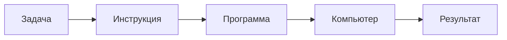

# DESIGN — Почему существует программирование? (Part I / 0)

**Статус:** **Publish** v1.2 · Owner Agree on [0001b](../../reviews/0001b-what-is-programming.md) · spine = Part I master diagram
**Глава:** текст **v1.1**; скелет не менять без нового Design Review  
**Topic id:** `fundamentals/what-is-programming`  
**Faculty:** Computer Science (вход) · мост в Software Engineering  
**Paths:** Beta Step 1 · Alpha Stage 0 (mental reset)  
**Interview Heat:** ★★★  
**Levels:** 1 + 2 обязательны · 3 = лёгкий слой Compiler/CPU (без SIL/LLVM)

**Pipeline:** [chapter-fill](../../.ai/workflows/chapter-fill.md) · checklist [chapter-design](../../.ai/checklists/chapter-design.md)

---

## Design Review №1 (2026-07-24)

| Поле | Решение Review |
|------|----------------|
| **До → После** | «Программирование = писать код» → «Программирование = формализация решения задачи для машины» |
| **Главная мысль** | Компьютеры не думают. Они безупречно выполняют инструкции. Поэтому существует программирование. |
| **Эмоция** | Не «выучил определение». А «Почему мне этого никто раньше не объяснял?» / «Теперь я понимаю.» |
| **Результат главы** | Перестать думать «я учу Swift» → начать «я учу способы объяснить машине решение задачи» |
| **Порядок** | Человек-исполнитель и алгоритм (чай) **раньше** timeline языков; SE как отдельный удар; пример заказа |
| **Университет** | Не iOS Knowledge Base. Учебник CS/SE, где iOS — специализация (см. ниже) |

Исходный черновик дизайна переписан под Review №1. Старые акценты (книги как главный пример) сняты в пользу **заказа** + чай для алгоритма.

---

## Passport (контракт)

1. **What:** идея программирования как формализации задач в точные инструкции.  
2. **Problem:** мир неоднозначен; машина буквальна.  
3. **Why:** нужны повторяемые, точные, масштабируемые решения без «догадок» исполнителя.  
4. **Before:** устные/письменные поручения людям.  
5. **Why not enough:** люди устают, ошибаются, трактуют по-разному.  
6. **Modern:** языки + абстракции + Software Engineering полного цикла.  
7. **Next:** Computer → CPU → Binary → Machine Code → Compiler → Algorithms → … → Swift / Apple / iOS / AI.  
8. **Where used:** весь Path Beta; mental reset для Alpha.

**Fundamental why:** Почему компьютеру вообще нужны программы?
**H1 (invitation):** Почему существует программирование?

**Анти-цель:** справочник синтаксиса / «урок Swift №0».

---

## Место в университете (важно)

```text
Computer Science
  → Programming          ← эта глава (Глава 0)
  → Software Engineering
  → Operating Systems
  → Networks
  → Architecture
  → Swift                ← инструмент, не старт вселенной
  → Apple Platforms
  → iOS Development
  → AI Engineering
```

Swift / iOS — сильная специализация Mobile Systems, не точка «нулевого знания о мире».

---

## Карта страницы (после Review №1)

```text
1  Hero
2  Интуиция / «история с человека» (нет компьютеров → исполнительный помощник)
3  Что делает компьютер (диаграмма Задача→…→Результат)
4  Что такое программа (чай: плохо/хорошо → идея алгоритма)
5  Что делает программист (coder vs понимание→…→поддержка)
6  Краткая история языков (timeline ≤ «2–3 экрана», не книга)
7  Компьютер не знает Swift (Swift→Compiler→Machine Code→CPU)
8  Абстракции (этажи SwiftUI…CPU)
9  Один пример × 4 формы (стоимость заказа)
10 Software Engineering (программа vs система на годы)
11 Senior Interview
12 Практика
13 Что читать / связанные главы
14 Рефлексия
```

Целевое время: 20–35 мин L1–L2; Senior: блоки 5, 7–8, 10–11 за ~10 мин.

---

## 1. Hero

| Элемент | Контракт |
|---------|----------|
| **H1** | Почему существует программирование? |
| **Подзаголовок** | Не про код. Про способ объяснить машине, как решать задачи. |
| **Pull quote** | *Компьютеры не думают. Они безупречно выполняют инструкции.* |
| **Иллюстрация I1** | Человек · компьютер · между ними инструкция (единый минималистичный стиль университета) |
| **Promise** | После первой страницы — сдвиг понимания, не определение для зубрёжки |

---

## 2. Интуиция (с человека)

**Не начинать с компьютеров.**

История-крючок (утверждено Review):

> Представьте: компьютеров нет. Есть только бесконечно исполнительный человек, который сам ничего не понимает.  
> С этого начинается программирование.

Затем мост: современный компьютер — тот же род буквального исполнителя, только быстрее.

**Эмоция секции:** «Почему мне этого никто раньше не объяснял?»

---

## 3. Что делает компьютер

**Диаграмма D1 (простая):**

```text
Задача → Инструкция → Программа → Компьютер → Результат
```

Мысль: программа — зафиксированная цепочка инструкций под задачу.

Mermaid (для вёрстки):



---

## 4. Что такое программа (чай → алгоритм)

**Пример:** приготовить чай.

| Плохо | Хорошо |
|-------|--------|
| Сделай чай. | Налей воду → вскипяти → положи пакетик → подожди → достань пакетик. |

Здесь впервые называется **алгоритм**: конечная, упорядоченная, однозначная последовательность шагов.

Callout: неоднозначности («подожди», «вкусный») — дырки, которые машина не закроет сама.

---

## 5. Что делает программист

Снять миф «пишет код».

```text
Понимает проблему
  → Изучает ограничения
  → Проектирует решение
  → Пишет код
  → Тестирует
  → Поддерживает
```

**Удар главы:** разница **coder** vs **engineer** появляется здесь впервые.

Иллюстрация I3: две колонки / два пути.

---

## 6. Небольшая история программирования

Объём: **коротко** (ощущение 2–3 экранов, не глава-энциклопедия).  
Форма: красивая timeline + одна мысль.

```text
Jacquard Loom → перфокарты → Babbage → Ada Lovelace
  → Assembly → C → Objective-C → Swift
```

**Главная мысль блока:** менялся **язык общения** с машиной. Не менялась **идея** (задача → точные шаги → исполнитель).

Иллюстрация I2: эволюция носителей инструкций.

---

## 7. Компьютер не знает Swift

**Диаграмма D4:**

```text
Swift → Compiler → Machine Code → CPU
```

По одной фразе на уровень (перевод / числа-инструкции / исполнение). Без LLVM deep dive.

Аналогия: Compiler — переводчик.  
Иллюстрация I5: переводчик за столом.

---

## 8. Абстракции

Визуал (ASCII → финальная инфографика I4):

```text
┌──────────────────────┐
│ SwiftUI              │
├──────────────────────┤
│ Swift                │
├──────────────────────┤
│ Objective-C / C      │
├──────────────────────┤
│ Assembly             │
├──────────────────────┤
│ Machine Code         │
├──────────────────────┤
│ CPU                  │
└──────────────────────┘
```

Подпись: **Каждый уровень скрывает сложность предыдущего.**  
Senior-строка: абстракции платны — иногда нужно спуститься.

---

## 9. Один пример (четыре формы)

**Задача:** посчитать стоимость заказа (позиции + налог/скидка — упростить до ясных правил).

```text
Обычный язык → Алгоритм → Псевдокод → Swift
```

**Идея одна. Меняется только форма записи.**

Иллюстрация I6: четыре панели одной задачи.

---

## 10. Software Engineering (самый важный удар)

| | |
|--|--|
| **Программирование** | Создать работающую программу |
| **Software Engineering** | Создать систему, которая останется работоспособной через годы |

Мост к Production-циклу (исследование → дизайн → код → тесты → поддержка) без выдуманного личного опыта.

Иллюстрация I7: программа vs система во времени.

---

## 11. Senior Interview (проекция)

| Вопрос | Угол ответа |
|--------|-------------|
| Почему существует программирование? | Машине нужны точные инструкции; язык — форма, не причина |
| Почему существуют языки? | Абстракции / выразительность / безопасность |
| Что делает Compiler? | Перевод к Machine Code |
| Чем инженер отличается от «просто программиста»? | Цикл, ограничения, годы жизни системы |
| Что такое абстракция? | Скрытие сложности; цена контроля |

Follow-ups: ambiguity в спеках; когда спускаться с SwiftUI на UIKit/C; clarifying questions.

Типичные ошибки: «программирование = синтаксис»; «Senior = больше строк»; магия AI вместо инструкций.

---

## 12. Практика

| # | Задание | Навык |
|---|---------|--------|
| 1 | Объясни, как приготовить бутерброд → найди неоднозначности | ambiguity |
| 2 | Объясни сортировку книг на полке | алгоритм словами |
| 3 | Максимально короткая инструкция «роботу» (буквальному) | полнота vs краткость |
| 4 (опц.) | Стоимость заказа: псевдокод → Swift playground | форма записи |
| 5 (Senior) | 5 clarifying questions к «Сделай экран как у банка» | interview habit |

---

## 13. Что читать / дальше по графу

```text
Что такое компьютер
  → Как работает CPU
  → Binary
  → Machine Code
  → Compiler
  → Алгоритмы
  → (позже) Memory · OS · Networks · Architecture · Swift · Apple · iOS · AI
```

Первоисточники (shortlist в главу, остальное — Next): Petzold *Code* · CSAPP · SICP · Nand2Tetris · Swift Book Basics · Crafting Interpreters (мост к Compiler).

---

## 14. Рефлексия

> Что изменилось в твоём понимании?  
> До/после: «писать код» → «формализовать решение для машины»?

---

## Иллюстрации (8–10, единый минималистичный стиль)

| ID | Сцена | Секция |
|----|-------|--------|
| I1 | Человек объясняет задачу машине (инструкция между ними) | Hero |
| I2 | Эволюция программирования (timeline) | История |
| I3 | Программист ↔ инженер | §5 |
| I4 | Уровни абстракции (этажи) | §8 |
| I5 | Compiler как переводчик | §7 |
| I6 | Путь / четыре формы одной задачи | §9 |
| I7 | Развитие языков (компактно) | §6 |
| I8 | Цикл разработки продукта / система на годы | §10 |
| I9–I10 | Запас: буквальный исполнитель; «дырка» в инструкции | §2–4 |

Стиль: один visual language на весь университет (не клипарт, не детский мульт, не неон-AI).

---

## Диаграммы — мысль каждой

| ID | Мысль |
|----|--------|
| D1 | Задача становится результатом только через инструкции |
| D4 | Swift не исполняется «как есть» |
| D5 | Этажи абстракций |
| D6 | Одна идея — четыре записи |
| D-SE | Программа vs система во времени |

---

## Критерии приёмки дизайна (Review №1)

- [x] До/после ментальной модели зафиксированы  
- [x] Эмоция «теперь понимаю» / не определение  
- [x] Порядок: человек → алгоритм → coder/engineer → история языков → Compiler → абстракции → пример → SE → interview → практика  
- [x] SE — отдельный удар  
- [x] Swift не стартовая точка университета  
- [x] История короткая  
- [x] 8–10 иллюстраций в едином стиле заложены  
- [x] **Owner Approve** (2026-07-24 — «апрув»)  
- [x] Phase B v1 (`README.md` + `notes/Interview-Pack.md`)  
- [x] Content review [0001](../../reviews/0001-what-is-programming.md) — **Request changes** (avg 7.5)  
- [ ] Author fixes per 0001  
- [ ] Dual-pass Accept  
- [ ] Assets I1–I8 (or cut must-have in DESIGN)  
- [ ] Playground для примера заказа (optional)  

---

## Phase B log

1. Author v1: `README.md` по карте Review №1.  
2. Mermaid в тексте; I1–I8 — TODO placeholders.  
3. Interview pack projection.  
4. Review 0001 (2026-07-24): Request changes — история-как-боль; must-have visuals; Beginner note на Swift.  
5. Next: Author fixes → Reviewer Accept pass.
