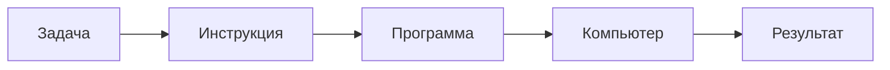
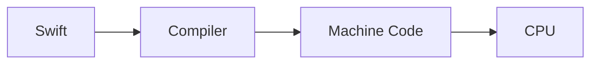

# Что такое программирование?

- **Topic id:** `fundamentals/what-is-programming`
- **Faculty:** Computer Science
- **Path heat:** Beta Step 1 · Alpha Stage 0
- **Status:** `learning` (текст v1 после Owner Approve DESIGN)
- **Confidence:** — /5 (заполни после чтения)
- **Interview Heat:** ★★★
- **Levels present:** 1 / 2
- **Fundamental question:** Почему «написание кода» — слишком узкое определение программирования?

> Компьютеры не думают.  
> Они безупречно выполняют инструкции.  
> Именно поэтому существует программирование.

**Не про код.** Про способ объяснить машине, как решать задачи.

*(Иллюстрация I1 — TODO: человек · компьютер · инструкция между ними, единый стиль университета.)*

Контракт страницы: [DESIGN.md](DESIGN.md).

---

## Интуиция

Представьте: компьютеров нет.

Есть только человек, который:

- никогда не устаёт;
- никогда не «додумывает»;
- делает ровно то, что сказано — и ничего сверх того.

Сможете ли вы объяснить ему, как заварить чай? Как собрать заказ в магазине? Как посчитать сдачу?

В момент, когда вы начинаете убирать двусмысленность из обычной речи, вы уже занимаетесь **программированием**.

Современный компьютер — тот же род исполнителя. Только быстрее. Он не «умный» в человеческом смысле. Он **дисциплинированный**.

> Хорошее чувство после этой страницы — не «я запомнил определение», а «почему мне этого раньше никто так не объяснил?»

---

## Что делает компьютер

Машина не понимает желания. Она исполняет инструкции.



| Слово | Смысл здесь |
|-------|-------------|
| **Задача** | Что нужно получить в мире (заказ, экран, отчёт) |
| **Инструкция** | Один однозначный шаг |
| **Программа** | Зафиксированная последовательность шагов |
| **Компьютер** | Буквальный исполнитель |
| **Результат** | То, что получилось (или ошибка, если шаги дырявые) |

---

## Что такое программа

Возьмём чай.

| Плохо | Хорошо |
|-------|--------|
| Сделай чай. | 1. Налей воду в чайник. 2. Доведи до кипения. 3. Положи пакетик в кружку. 4. Залей кипятком. 5. Подожди N минут. 6. Достань пакетик. |

В колонке «хорошо» появляется **алгоритм**: конечная, упорядоченная, по возможности однозначная последовательность шагов.

«Подожди, пока будет вкусно» — дырка. Два человека поймут по-разному. Буквальный исполнитель — никак.

> Программа — это алгоритм, записанный в форме, которую машина умеет исполнять.

---

## Что делает программист

Большинство думает: *пишет код*.

На деле код — узкий участок пути.

```text
Понимает проблему
  → Изучает ограничения
  → Проектирует решение
  → Пишет код
  → Тестирует
  → Поддерживает
```

| Образ | Фокус |
|-------|--------|
| **Coder** | Чтобы «заработало в файле» |
| **Engineer** | Чтобы задача была понята, решение выдерживало ограничения и жило после merge |

Уточняющие вопросы к заказчику («что считать чаем?», «сколько минут?») — уже инженерия. Ещё до первой строки Swift.

*(Иллюстрация I3 — TODO: coder ↔ engineer.)*

---

## Краткая история: менялся язык, не идея

Люди долго искали способ **передавать инструкции** исполнителю — сначала механическому, потом электрическому.

```text
Jacquard Loom → перфокарты → Babbage → Ada Lovelace
  → Assembly → C → Objective-C → Swift
```

| Эпоха (очень грубо) | Как «говорили» | |
|---------------------|----------------|--|
| Ткацкий станок / карты | Дырки = шаги узора | Инструкция вне головы мастера |
| Ранние машины | Числа-команды (Machine Code) | Близко к железу |
| Assembly | Мнемоники вместо сырых чисел | Чуть человечнее |
| C | Выражения ближе к математике | Больше контроля, больше ответственности |
| Objective-C / Swift | Богатые абстракции, безопасность | Дальше от битов, ближе к задаче |

**Главная мысль блока:** менялся **язык общения** с машиной. Не исчезала **идея**: задача → точные шаги → исполнитель.

*(Иллюстрация I2 — TODO: timeline эволюции.)*

---

## Компьютер не знает Swift

Вы пишете на Swift. Процессор исполняет не «текст файла», а Machine Code.



| Уровень | Роль |
|---------|------|
| **Swift** | Язык, удобный человеку-инженеру |
| **Compiler** | Переводчик в форму, понятную машине |
| **Machine Code** | Инструкции в виде, готовом к исполнению |
| **CPU** | Считает и исполняет |

> Компьютер не «понимает Swift». Он исполняет переведённые инструкции. Подробности — в главах Compiler и CPU.

*(Иллюстрация I5 — TODO: Compiler как переводчик.)*

---

## Абстракции

Каждый этаж прячет сложность нижнего — чтобы думать о задаче, а не о каждом бите.

```text
┌──────────────────────┐
│ SwiftUI              │
├──────────────────────┤
│ Swift                │
├──────────────────────┤
│ Objective-C / C      │
├──────────────────────┤
│ Assembly             │
├──────────────────────┤
│ Machine Code         │
├──────────────────────┤
│ CPU                  │
└──────────────────────┘
```

Подпись: **каждый уровень скрывает сложность предыдущего.**

Senior-строка: абстракции **не бесплатны**. Иногда нужно спуститься (производительность, баг «на стыке», отладка).

*(Иллюстрация I4 — TODO: этажи абстракций.)*

---

## Один пример: стоимость заказа

Одна идея — четыре формы записи.

**Задача:** в корзине позиции с ценами; нужно получить итоговую сумму (упростим: без налогов и скидок).

### 1. Обычный язык

«Сложи цены всех товаров в корзине и покажи сумму.»

(Уже есть дырки: валюта? пустая корзина? округление?)

### 2. Алгоритм

1. Возьми список цен.  
2. Если список пуст — итог 0.  
3. Иначе начинай с 0 и по очереди прибавляй каждую цену.  
4. Верни итог.

### 3. Псевдокод

```text
total ← 0
for each price in cart:
    total ← total + price
return total
```

### 4. Swift

```swift
func orderTotal(prices: [Decimal]) -> Decimal {
    prices.reduce(0, +)
}
```

Идея одна. Меняется **форма**. Язык Swift здесь — инструмент записи, не суть программирования.

*(Иллюстрация I6 — TODO: четыре панели.)*

---

## Software Engineering

| | |
|--|--|
| **Программирование** | Создать работающую программу под задачу |
| **Software Engineering** | Создать систему, которая останется работоспособной **через годы** |

```text
Проблема → Исследование → Проектирование
  → Код → Тесты / ревью → Выпуск → Поддержка
```

Код — один узел. Рядом: ограничения (время, батарея, сеть, команда), риски, наблюдаемость, миграции, откаты.

В этом университете дальше будут Operating Systems, Networks, Architecture, Swift, Apple Platforms, iOS, AI — как слои одной картины, а не как «курс кнопок».

*(Иллюстрация I8 — TODO: программа vs система во времени.)*

---

## Senior Interview

Проекция, не второй учебник. Коротко ответьте себе вслух.

| Вопрос | На что смотрят |
|--------|----------------|
| Что такое программирование? | Формализация для машины, не «символы в файле» |
| Почему существуют языки? | Абстракции, выразительность, безопасность, скорость мысли |
| Что делает Compiler? | Перевод к Machine Code |
| Чем engineer отличается от «просто пишет код»? | Задача, ограничения, жизнь системы после merge |
| Что такое абстракция? | Скрытие сложности + цена контроля |

**Follow-ups:** пример дырки в спеке; когда спускаться с SwiftUI ниже; какие clarifying questions зададите заказчику.

**Типичные ошибки:** программирование = синтаксис; Senior = больше строк; «модель сама догадается».

Короткие ответы: [notes/Interview-Pack.md](notes/Interview-Pack.md).
---

## Практика

| # | Задание |
|---|---------|
| 1 | Объясните, как приготовить бутерброд. Затем выпишите неоднозначности. |
| 2 | Объясните сортировку книг на полке человеку, который ничего не додумывает. |
| 3 | Дайте роботу максимально короткую, но полную инструкцию (выберите бытовую задачу). |
| 4 | Стоимость заказа: допишите правило скидки «−10%, если сумма > 1000» на псевдокоде, затем на Swift. |
| 5 (Senior) | Фраза заказчика: «Сделай экран как у банковского приложения.» Напишите 5 clarifying questions. |

---

## Что читать дальше

```text
Что такое компьютер
  → CPU
  → Binary
  → Machine Code
  → Compiler
  → Алгоритмы
  → Memory · OS · Networks · Architecture
  → Swift · Apple Platforms · iOS · AI Engineering
```

В Library пока часть узлов — будущие главы. Ближайшие опоры:

- [Computer Science](../computer-science/) — фундамент «почему так в Swift/iOS»
- [Development Principles](../development-principles/) — ремесло инженера
- Path: [Beta](../../campus/paths/beta.md) · позже Mobile: concurrency, SwiftUI как системы

**Первоисточники (shortlist):**

- [The Swift Programming Language — The Basics](https://docs.swift.org/swift-book/documentation/the-swift-programming-language/thebasics/)
- [Nand2Tetris](https://www.nand2tetris.org/)
- [Crafting Interpreters](https://craftinginterpreters.com/)
- *Code: The Hidden Language of Computer Hardware and Software* (Petzold)
- *Computer Systems: A Programmer's Perspective* (CSAPP)
- *Structure and Interpretation of Computer Programs* (SICP)

---

## Рефлексия

> Что изменилось в твоём понимании после этой главы?  
> Не список терминов — сдвиг:  
> **до:** «программирование = писать код»  
> **после:** «программирование = формализация решения задачи для машины»

Запиши одной фразой в Progress Path (Beta или Alpha Stage 0).

---

## Evidence (шаблон)

| Date | Status | Confidence | Notes |
|------|--------|------------|-------|
| 2026-07-24 | learning | — | v1 текста после Approve DESIGN; assets I1–I8 TODO; dual-pass Reviewer — next |
