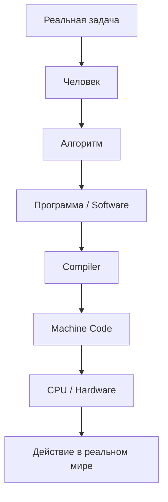
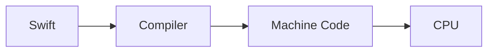

<p class="chapter-kicker">Computer Science · Foundations · Part I</p>

# Почему существует программирование?

<p class="chapter-deck">
Программирование — это не написание кода.
Это способ объяснить машине, как решить задачу.
</p>

<p class="chapter-meta">
≈ 20 мин · Interview ★★★ · Path Beta · Глава 0
</p>

| | |
|--|--|
| **Дальше** | [Part I](../PART_I.md) · глава 1 (скоро) |
| **Путь** | [Path Beta](../../campus/paths/beta.md) |

---

## Интуиция

Представьте: завтра исчезли все языки программирования.

Ни Swift. Ни Python. Ни C. Ничего.

У вас остался только компьютер.

Сможете ли вы заставить его работать?

Если нет — вы ещё не понимаете, **зачем** существует программирование. Язык — удобная форма. Нужда глубже: машине нужны **программы** — точные инструкции, которые она умеет исполнять.

---

## Аксиома: компьютер не ошибается

<aside class="eu-axiom">
<p class="eu-axiom-label">Engineering Axiom</p>
<p>Компьютер почти никогда не делает «не то».</p>
<p>Он безошибочно делает <strong>именно то, что вы ему сказали</strong> — даже если вы хотели совсем другое.</p>
</aside>

Ошибается человек: в задаче, в спецификации, в шагах, в допущениях.

Эта мысль проходит через весь университет: баг в проде, flaky тест, «странное» поведение UI — сначала ищите дырку в инструкции и в модели задачи, а не «злой процессор».

---

## Software и Hardware

Пока без глубокого железа — только два слова, без которых дальше нельзя.

| | |
|--|--|
| **Software** | Зафиксированная инструкция для машины (программа и всё, что её окружает как артефакт) |
| **Hardware** | Машина, которая умеет эту инструкцию исполнять |

Программирование существует на стыке: у Hardware нет желаний; у Software нет рук. Связь — точная инструкция.

Позже Operating System ответит на вопрос: почему программы обычно не работают «напрямую» с железом. Сейчас достаточно этой пары.

---

## Карта главы (spine)

Одна вертикаль — её вы ещё не раз встретите в Part I.



Что становится понятнее: программирование — не «файл со Swift», а путь от задачи в мире до действия в мире. Язык и Compiler — ступени пути, не его смысл.

Эту вертикаль повторяем в Part I, подсвечивая текущий уровень ([Part I](../PART_I.md)).

---

## Новая модель

| До | После |
|----|--------|
| Код → компьютер | Проблема → алгоритм → программа → компьютер → результат |
| «Нужен язык» | «Нужны точные инструкции; язык — форма записи» |
| «Компьютер глючит» | «Исполнено ровно то, что сказано» |

---

## Буквальный исполнитель

Представьте помощника, который:

- никогда не устаёт;
- никогда не «додумывает»;
- делает ровно то, что сказано — и ничего сверх того.

Сможете ли вы объяснить ему, как заварить чай? Как собрать заказ? Как посчитать сдачу?

В момент, когда вы убираете двусмысленность из обычной речи, вы уже занимаетесь тем, ради чего существует программирование.

Современный компьютер — тот же род исполнителя. Только быстрее. Он не «умный» в человеческом смысле. Он **дисциплинированный**.

---

## Что такое программа

Возьмём чай.

| Плохо | Хорошо |
|-------|--------|
| Сделай чай. | 1. Налей воду в чайник. 2. Доведи до кипения. 3. Положи пакетик в кружку. 4. Залей кипятком. 5. Подожди N минут. 6. Достань пакетик. |

В колонке «хорошо» появляется **алгоритм**: конечная, упорядоченная, по возможности однозначная последовательность шагов.

«Подожди, пока будет вкусно» — дырка. Два человека поймут по-разному. Буквальный исполнитель — никак. В проде та же дырка звучит как: «сделай экран как у банка» без критериев.

> Программа — алгоритм, записанный в форме, которую машина умеет исполнять (Software для Hardware).

<p class="eu-level-gate"><strong>Level 1</strong> — понимание идеи: достаточно досюда. Ниже — углубление (код опционален).</p>

---

## От задачи к программе

Цепочка та же, что на spine: задача → человек → алгоритм → программа → компьютер.

Большинство думает, что «программирование» начинается на шаге «написать код». На деле код — узкий участок пути человека, который собирает программу.

```text
Понимает проблему
  → Изучает ограничения
  → Проектирует решение
  → Пишет код
  → Тестирует
  → Поддерживает
```

| Образ | Фокус |
|-------|--------|
| **Coder** | Чтобы «заработало в файле» |
| **Engineer** | Чтобы задача была понята, решение выдерживало ограничения и жило после merge |

Уточняющие вопросы к заказчику — уже инженерия на участке «человек → алгоритм». Ещё до первой строки Swift.

---

## Краткая история: менялся язык общения

На протяжении истории менялся не сам факт исполнителя.

Менялся **язык общения** с исполнителем.

Инструкции сначала жили только в голове мастера. Потом их вынесли наружу — карты, числа, мнемоники, языки вроде C и Swift — чтобы передавать шаги быстрее и безопаснее. Боль была одна: *как сказать машине однозначно*.

```text
Карты / ранние машины → Machine Code → Assembly → C → Objective-C → Swift
```

Имена эпох — ориентиры, не экзамен. Вывод важнее списка:

> Менялся язык. Не исчезала идея: задача → точные шаги → исполнитель → результат в мире.

---

## Почему тогда нужны языки и Compiler?

Вы пишете на Swift. Процессор исполняет не «текст файла», а Machine Code.



| Уровень | Роль |
|---------|------|
| **Swift** | Язык, удобный человеку-инженеру |
| **Compiler** | Переводчик в форму, понятную машине |
| **Machine Code** | Инструкции, готовые к исполнению |
| **CPU** | Считает и исполняет (Hardware) |

Compiler здесь появляется как ответ на боль «человек не хочет писать сырые команды», а не как словарная статья. Глубже — в главах Binary → Machine Code → Compiler ([Part I](../PART_I.md)).

---

## Абстракции

Каждый этаж прячет сложность нижнего — чтобы думать о задаче, а не о каждом бите.

```text
┌──────────────────────┐
│ SwiftUI              │
├──────────────────────┤
│ Swift                │
├──────────────────────┤
│ … ниже до CPU …      │
└──────────────────────┘
```

Абстракции **не бесплатны**. Иногда нужно спуститься (производительность, баг на стыке, отладка).

---

## Один пример: стоимость заказа

Одна идея — четыре формы. (Если Swift нечитаем — остановитесь на псевдокоде.)

**Задача:** в корзине цены; нужна сумма (без налогов и скидок).

### 1. Обычный язык

«Сложи цены всех товаров и покажи сумму.»  
(Дырки: валюта? пустая корзина? округление?)

### 2. Алгоритм

1. Возьми список цен.  
2. Если пуст — итог 0.  
3. Иначе с 0 прибавляй каждую цену.  
4. Верни итог.

### 3. Псевдокод

```text
total ← 0
for each price in cart:
    total ← total + price
return total
```

### 4. Swift

```swift
func orderTotal(prices: [Decimal]) -> Decimal {
    prices.reduce(0, +)
}
```

Идея одна. Меняется **форма**. Swift — инструмент записи, не причина существования программирования.

---

## Software Engineering

| | |
|--|--|
| **Программирование** | Создать работающую программу под задачу |
| **Software Engineering** | Создать систему, которая останется работоспособной **через годы** |

```text
Проблема → Исследование → Проектирование
  → Код → Тесты / ревью → Выпуск → Поддержка
```

Код — один узел. Рядом: ограничения, риски, наблюдаемость, откаты.

Дальше в университете: OS, Networks, Architecture, Swift, Apple Platforms, iOS, AI — слои одной картины, не «курс кнопок».

---

## Senior Interview

| Вопрос | На что смотрят |
|--------|----------------|
| Почему компьютеру нужны программы? | Точные инструкции; машина не угадывает желания |
| Почему существует программирование? | Формализация для буквального исполнителя |
| Компьютер «ошибся» — что сказать? | Исполнено сказанное; ищите дырку у человека |
| Что делают языки / Compiler? | Удобная форма + перевод к Machine Code |
| Engineer vs «просто пишет код»? | Задача, ограничения, жизнь после merge |

**Follow-ups:** дырка в спеке; когда спускаться с абстракции; clarifying questions заказчику.

**Типичные ошибки:** программирование = синтаксис; «модель сама догадается»; винить Hardware без проверки инструкции.

Короткие ответы: [notes/Interview-Pack.md](notes/Interview-Pack.md).

---

## Практика

| # | Задание |
|---|---------|
| 1 | Объясните бутерброд. Выпишите неоднозначности. |
| 2 | Сортировка книг для человека, который ничего не додумывает. |
| 3 | Короткая, но полная инструкция роботу (бытовая задача). |
| 4 | Скидка «−10%, если сумма > 1000»: псевдокод, затем Swift (опционально). |
| 5 (Senior) | «Сделай экран как у банка.» — 5 clarifying questions. |

---

## Что читать дальше

Ближайшие три якоря Part I:

1. Что такое компьютер? (буквальный исполнитель)  
2. Как компьютер исполняет программу?  
3. Binary — почему только Binary?

Полный модуль: [Part I](../PART_I.md).

**Первоисточники (shortlist):** Nand2Tetris · Petzold *Code* · CSAPP · SICP · [Swift Book — The Basics](https://docs.swift.org/swift-book/documentation/the-swift-programming-language/thebasics/)

---

## Рефлексия

> Что изменилось в твоём понимании?  
> **до:** код → компьютер · «нужен язык» · «машина глючит»  
> **после:** проблема → алгоритм → программа → Hardware → результат в мире · ошибается человек · язык — форма

Одной фразой — в [Progress Path Beta](../../campus/paths/beta.md).

Дальше: [Part I](../PART_I.md) → глава 1 (скоро).

---

<details>
<summary>For contributors</summary>

| | |
|--|--|
| **Topic id** | `fundamentals/what-is-programming` |
| **Version** | v1.2 |
| **Design** | [DESIGN.md](DESIGN.md) |
| **Reviews** | [0001](../../reviews/0001-what-is-programming.md) · [0001b](../../reviews/0001b-what-is-programming.md) |
| **Creator Portal** | [`.author/`](../../.author/) |

</details>
