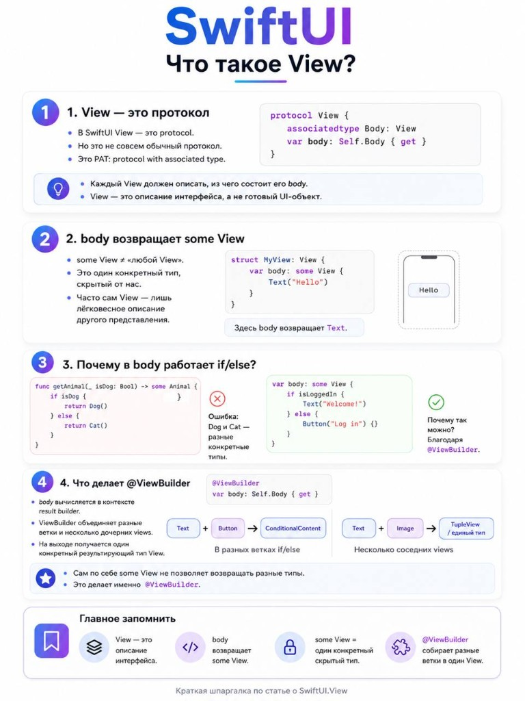
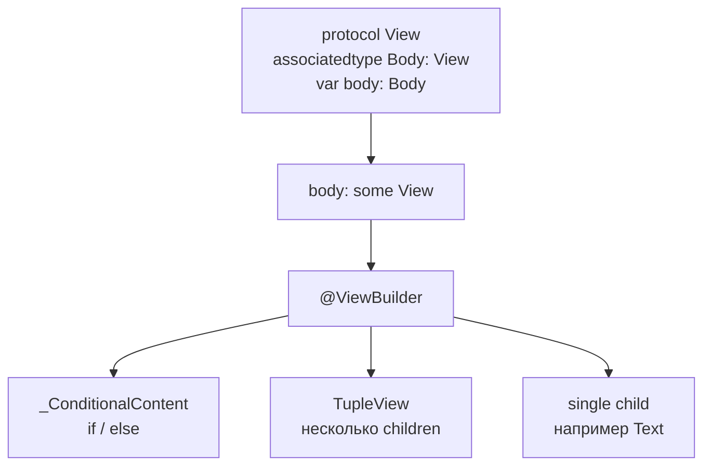

# SwiftUI: что такое `View`

- **Status:** curated note
- **Added:** 2026-07-17
- **Related:** [SwiftUI README](../README.md) · [Protocols](../../../swift/protocols/README.md) · opaque types в Swift Book

---

## Infographic



---

## In 30 seconds

В SwiftUI `View` - это **протокол** (PAT с `associatedtype Body: View`), а не готовый UI-объект. `body` возвращает `some View` - **один конкретный**, скрытый тип. Разные ветки `if/else` и несколько соседних child views в `body` работают благодаря `@ViewBuilder` (result builder), который сводит их к одному результирующему типу (`_ConditionalContent`, `TupleView`, …).

---

## Mental model



`View` описывает интерфейс. Система сама решает, когда пересчитать `body` и что нарисовать.

---

## 1. `View` - протокол (PAT)

Упрощённо:

```swift
protocol View {
    associatedtype Body: View
    @ViewBuilder var body: Self.Body { get }
}
```

- Это **PAT** (protocol with associated type) - нельзя писать `any View` «как угодно» там, где нужен один конкретный тип без erasure / opaque.
- Каждый `View` обязан описать, из чего состоит его `body`.
- `View` - **описание** UI, не финальный объект на экране.

---

## 2. `body` возвращает `some View`

```swift
struct MyView: View {
    var body: some View {
        Text("Hello")
    }
}
```

- `some View` **не** значит «любой View».
- Это **opaque return type**: один конкретный тип, скрытый от вызывающего кода.
- Здесь реальный тип `body` - `Text`.

Часто твой `View` - лёгкая обёртка над другим view (стек, модификаторы, conditional).

---

## 3. Почему в `body` работает `if/else`

Обычный Swift с `some Animal`:

```swift
func getAnimal(_ isDog: Bool) -> some Animal {
    if isDog { Dog() } else { Cat() } // error: разные concrete types
}
```

В SwiftUI:

```swift
var body: some View {
    if isLoggedIn {
        Text("Welcome!")
    } else {
        Button("Log in") {}
    }
}
```

Это разрешено, потому что `body` размечен `@ViewBuilder`. Builder **не** возвращает «то `Text`, то `Button`» как два разных opaque типа - он строит **один** тип, например `_ConditionalContent<Text, Button<…>>`.

---

## 4. Что делает `@ViewBuilder`

`body` вычисляется в контексте **result builder**.

| Ситуация | Что собирается |
|----------|----------------|
| Ветки `if` / `else` | `_ConditionalContent<TrueContent, FalseContent>` |
| Несколько соседних views | `TupleView<(…)>` (или эквивалентный single type) |
| Один child | сам этот тип |

Важно:

- сам по себе `some View` **не** разрешает разные типы в ветках;
- это делает именно `@ViewBuilder`.

Тот же атрибут можно ставить на свои `@ViewBuilder` closures / computed properties, чтобы собирать children так же, как в `body`.

---

## Best practices & mistakes

| Делай | Не делай |
|-------|----------|
| Думай о `View` как о value-описании | Жди, что `struct MyView` - «экранный объект» как `UIView` |
| Помни: `some View` = один скрытый тип | Путай `some View` с `any View` |
| Для разных веток опирайся на `@ViewBuilder` | Пытайся вернуть два разных concrete type из обычной функции `-> some View` без builder |
| Выноси сложные ветки в `@ViewBuilder` свойства | Раздувай `body` без нужды (тяжелее читать и отлаживать identity) |

---

## Interview Q&A (Knowledge cards)

**Q1. `View` - класс или протокол?**  
A: Протокол с associated type `Body`. Конкретные экраны обычно `struct …: View`.

**Q2. Чем `some View` отличается от «любого View»?**  
A: Opaque type - компилятор знает один конкретный тип; снаружи он скрыт. Это не existential `any View`.

**Q3. Почему `if/else` в `body` компилируется, а в обычной `-> some T` функции - нет?**  
A: У `body` (и `@ViewBuilder` closures) result builder сводит ветки к одному типу (`_ConditionalContent` и т.п.).

**Q4. Что будет, если в `body` подряд два `Text` без контейнера?**  
A: `@ViewBuilder` соберёт их в `TupleView` (или аналог), а не «два return».

---

## Apple docs

- [View](https://developer.apple.com/documentation/swiftui/view)
- [ViewBuilder](https://developer.apple.com/documentation/swiftui/viewbuilder)
- [Opaque Types](https://docs.swift.org/swift-book/documentation/the-swift-programming-language/opaquetypes/) — Swift Book
- [Result Builders](https://docs.swift.org/swift-book/documentation/the-swift-programming-language/advancedoperators/#Result-Builders)

---

## Главное запомнить

1. `View` - описание интерфейса (протокол / PAT).
2. `body` возвращает `some View`.
3. `some View` = один конкретный скрытый тип.
4. `@ViewBuilder` собирает ветки и children в один View-тип.

---

## Link to parent topic

- [SwiftUI README](../README.md)
- [swift/protocols](../../../swift/protocols/README.md) — protocols + `some View` в iOS use cases
