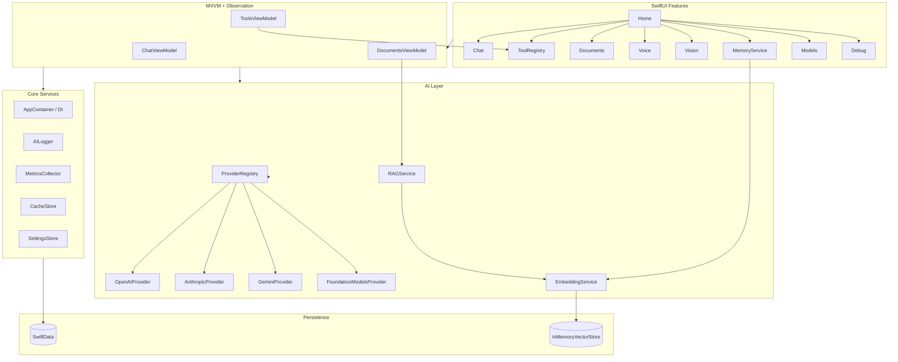
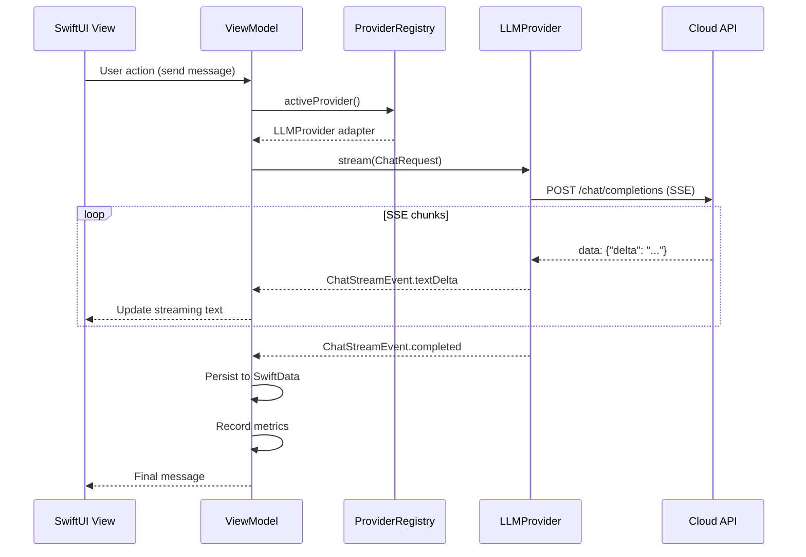

# AI Workspace for iOS

A portfolio-grade iOS application that unifies modern AI technologies in a single codebase. Each module is an independent learning lab you can study, demo, and explain in technical interviews.

## What This Project Demonstrates

| Module | AI Concepts |
|--------|-------------|
| **Chat** | LLM integration, SSE streaming, markdown, history, retry/cancel/regenerate |
| **Structured Output** | JSON Schema, Codable, validation, error recovery |
| **Tools** | Tool registry, function calling, argument validation, multi-step execution |
| **Voice** | Speech recognition, TTS, VAD pipeline, interruption |
| **Vision** | Vision models, image understanding, OCR |
| **Documents** | RAG — chunking, embeddings, cosine similarity, citations |
| **Memory** | Long-term semantic memory, vector search, context injection |
| **Models** | Multi-provider abstraction, adapter pattern, capability matrix |
| **Foundation Models** | On-device vs cloud comparison |
| **MCP** | Model Context Protocol integration scaffold |
| **Debug** | Prompt tracing, token usage, latency metrics |

## Architecture



## AI Request Lifecycle



## Tech Stack

- **iOS**: Swift 6, SwiftUI, Swift Concurrency, Observation, SwiftData
- **AI Providers**: OpenAI, Anthropic, Gemini, Apple Foundation Models
- **Patterns**: MVVM, Feature Modules, Repository, Protocol-first, DI

## Project Structure

```
AIWorkspace/
├── App/                    # Entry point, DI container, App Intents
├── Core/                   # Settings, logging, metrics, UI components
├── Domain/                 # Models, protocols, errors
├── AI/
│   ├── Providers/          # OpenAI, Anthropic, Gemini, Foundation Models
│   ├── Streaming/          # SSE parser
│   ├── Tools/              # Tool registry & orchestrator
│   └── RAG/                # Embeddings, vector store, RAG pipeline
├── Data/                   # SwiftData models, caching
└── Features/               # Independent demo modules
    ├── Home/
    ├── Chat/
    ├── StructuredOutput/
    ├── Tools/
    ├── Voice/
    ├── Vision/
    ├── Documents/
    ├── Memory/
    ├── Models/
    ├── Settings/
    ├── Debug/
    └── MCP/
```

## Getting Started

### Requirements

- Xcode 16+
- iOS 18.0+
- API keys for OpenAI, Anthropic, and/or Gemini

### Setup

1. Clone the repository
2. Generate the Xcode project (if using XcodeGen):
   ```bash
   brew install xcodegen
   xcodegen generate
   ```
3. Open `AIWorkspace.xcodeproj`
4. Add your API keys in **Settings** module
5. Build and run on simulator or device

### API Keys

Configure in-app via **Settings** module:

- OpenAI — for Chat, Vision, Embeddings, RAG
- Anthropic — for Claude models
- Gemini — for Google models
- Foundation Models — on-device, no API key required (iOS 26+ / compatible devices)

## Key Architectural Decisions

See **[Architecture Decision Records](docs/adr/README.md)** for interview-ready explanations of every major choice — provider abstraction, streaming, SwiftData, tool calling, and more.

**[Project Audit](docs/PROJECT_AUDIT.md)** — current status, gaps, phased plan, and how we work.

### Protocol-First Provider Abstraction

All LLM providers conform to `LLMProvider`. The UI never knows which API is called — only the `ProviderRegistry` selects the adapter. This enables model switching without UI changes.

### Streaming via AsyncThrowingStream

SSE responses are parsed into `ChatStreamEvent` and exposed as `AsyncThrowingStream`. ViewModels consume events with `for try await`, supporting cancellation via `Task.cancel()`.

### Tool Calling Orchestrator

`ToolOrchestrator` runs a multi-step loop: LLM → tool calls → execute locally → feed results back → repeat until done. Tools are registered in `ToolRegistry` with validated JSON arguments.

### RAG Pipeline

1. **Chunk** documents with overlap (`DocumentChunker`)
2. **Embed** chunks via OpenAI embeddings (cached)
3. **Store** vectors in `InMemoryVectorStore`
4. **Retrieve** top-K by cosine similarity
5. **Generate** answer with citations

### Memory Architecture

User preferences are embedded and stored in a separate vector collection. Before each query, relevant memories are retrieved and injected into the system context.

## Implemented AI Capabilities

- [x] LLM Integration (multi-provider)
- [x] Streaming Responses (SSE)
- [x] Tool Calling (local registry)
- [x] Structured Outputs (JSON → Codable)
- [x] RAG (chunking, embeddings, retrieval, citations)
- [x] Embeddings & Vector Search
- [x] Semantic / Similarity Search
- [x] AI Memory (long-term context)
- [x] Vision Models (image analysis)
- [x] Speech Recognition & TTS
- [x] Foundation Models scaffold
- [x] Metrics (TTFT, tokens, cost)
- [x] Debug tracing
- [ ] MCP live server connection (scaffold ready)

## Lessons Learned

### What Was Hard

1. **Unified tool calling across providers** — OpenAI, Anthropic, and Gemini use different tool call formats. The adapter layer normalizes `ToolDefinition` but full cross-provider tool parsing needs provider-specific delta handlers in streaming.

2. **Streaming + tool calls** — Handling interleaved text and tool call deltas during SSE requires careful accumulator state per provider.

3. **Embeddings cost & caching** — Re-embedding identical chunks is expensive. `CacheStore` caches embedding vectors by text hash to avoid redundant API calls.

4. **Foundation Models availability** — On-device models have limited availability by device and OS version. The provider gracefully reports unavailability.

### Trade-offs

| Decision | Chosen | Alternative | Why |
|----------|--------|-------------|-----|
| Vector store | In-memory | SQLite/pgvector | Simpler for demo; swap for production |
| Embeddings provider | OpenAI only | Per-provider | Consistent dimensions, simpler RAG |
| MCP | Scaffold | Full implementation | Deferred until core modules stable |
| UI framework | SwiftUI + Observation | UIKit + Combine | Modern, aligns with spec |

## Interview Talking Points

1. **Draw the architecture** — UI → ViewModel → ProviderRegistry → LLMProvider → API
2. **Explain request lifecycle** — See sequence diagram above
3. **Demo tool calling** — "Remind me tomorrow to call John" → `createReminder()`
4. **RAG vs search** — Search matches keywords; RAG retrieves semantically similar chunks and generates grounded answers with citations
5. **Embeddings** — Text → high-dimensional vectors; similar meaning = close vectors; enables semantic search
6. **Cloud vs on-device** — Cloud: larger models, vision, tools. On-device: privacy, offline, lower latency, smaller context
7. **Scaling** — Swap `InMemoryVectorStore` for persistent DB, add rate limiting, implement provider-specific streaming tool parsers, add MCP transport

## Screenshots

> Add screenshots of each module after running on device/simulator.
> Recommended: Home, Chat (streaming), Tools (tool results), Documents (citations), Debug (metrics).

## License

MIT
