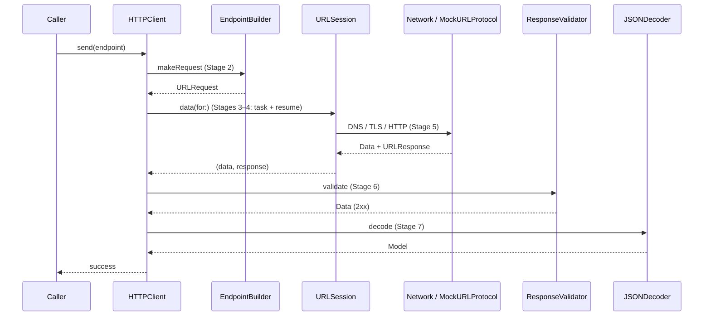
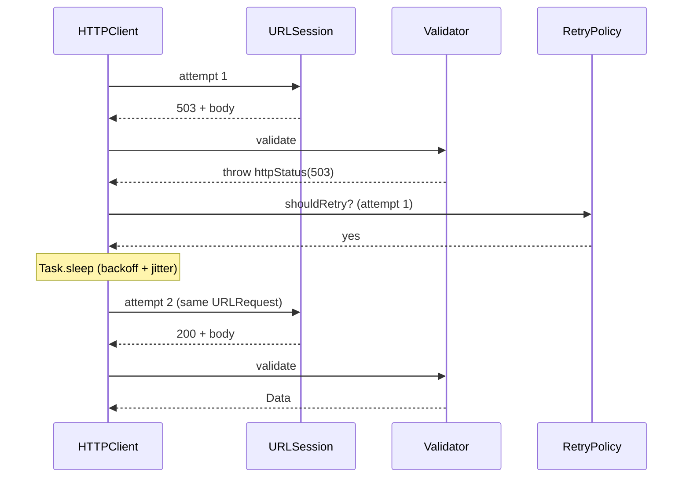
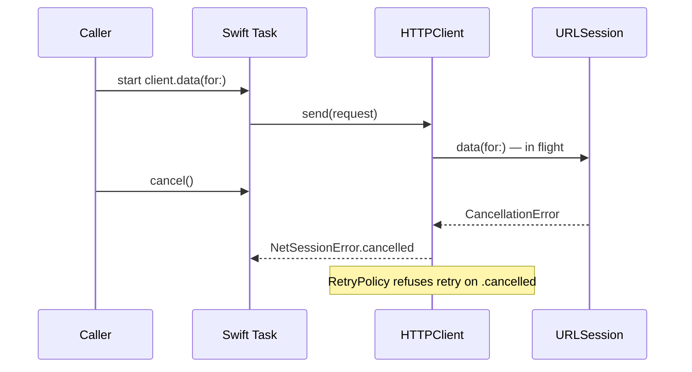

# NetSessionLab

Networking learning lab — **Phase 1 only**: typed HTTP client, validation, retry, cancel, Swift Testing with `MockURLProtocol`.

**Theory while learning:** [iOS IQ — URLSession lifecycle](https://iosiq.ru/urlsession-lifecycle.html) — primary article; see `docs/learning.md` for how to use it with this repo.

**Not in this repo yet:** TMDB demo, `ImageLoading`, `TMDBKit`, SwiftUI app. See `docs/architecture.md` — **🛑 STOP** after Phase 1.

## Status

| Phase | Scope | State |
|-------|--------|--------|
| **1 Core** | `NetSessionCore` SPM + tests | **Done** |
| 2 TMDB demo | SwiftUI + images | Not started |
| 3–4 Platform | metrics, background, WS | Not started |

## Who does what (Phase 1)

| Actor | Role | Waits for |
|-------|------|-----------|
| **Caller** (`Task` / test) | Calls `HTTPClient.send` or `data(for:)` | `HTTPClient` to return or throw |
| **HTTPClient** | Orchestrates Stages 2→7 | `URLSession`, `ResponseValidator`, `RetryPolicy`, `JSONDecoder` |
| **EndpointBuilder** | Stage 2: `Endpoint` → `URLRequest` | Nothing (sync) |
| **URLSession** | Stages 3–5: task, resume, real I/O | OS network stack (or `MockURLProtocol` in tests) |
| **MockURLProtocol** | Test-only Stage 5 fake | `requestHandler` closure |
| **ResponseValidator** | Stage 6: HTTP status before decode | `(Data, URLResponse)` from session |
| **RetryPolicy** | Stage 7: retry yes/no + delay | Error from validator or transport |
| **JSONDecoder** | Stage 7: `Decodable` | Validated `Data` |
| **NetSessionError** | Stage 7: domain errors at boundary | Mapped from `URLError` / cancel / HTTP / decode |

## Request flow (happy path)



## Request flow (503 → retry → 200)



## Request flow (cancel)



## Seven stages → files

| Stage | File | Step labels in code |
|-------|------|---------------------|
| 1 Configuration | `SessionConfiguration.swift` | 1.1–1.7, 1.T |
| 2 URLRequest | `Endpoint.swift` | 2.1–2.6 |
| 3 Create task | `HTTPClient.swift` | Step D |
| 4 resume() | `HTTPClient.swift` | Step D (inside `data(for:)`) |
| 5 Network I/O | system / `MockURLProtocol.swift` | Step E; tests: 5.M1–5.M6 |
| 6 Response | `ResponseValidator.swift` | 6.1–6.3 |
| 7 Complete | `HTTPClient`, `RetryPolicy`, `NetSessionError` | Steps A–J, G–J, 7.R*, 7.E1 |

## Stack

iOS 18+ · Swift 6 · SPM `NetSessionCore` · Swift Testing

## Quick start

```bash
swift test
```

## Layout

```
Sources/NetSessionCore/     commented pipeline (Stages 1–7)
Tests/NetSessionCoreTests/  MockURLProtocol + 9 tests
docs/cheatsheet.md          interview one-pager
docs/learning.md            iOS IQ article + study protocol
docs/architecture.md        roadmap + STOP
```

## Before an interview

1. README flow diagrams (this file)
2. `docs/cheatsheet.md` — questions → files
3. `swift test` — 9 tests green
4. Skim step comments in `HTTPClient.swift` and `Endpoint.swift`

## Related

- **Learning:** `docs/learning.md` — [iOS IQ article](https://iosiq.ru/urlsession-lifecycle.html) + map to code
- Career: `~/Developer/GitHub/Career/…/notes/URLSession-Lifecycle-iOS-IQ.md`
- Offline article: `~/Developer/GitHub/Career/_import/urlsession-lifecycle-iosiq-full.md`
